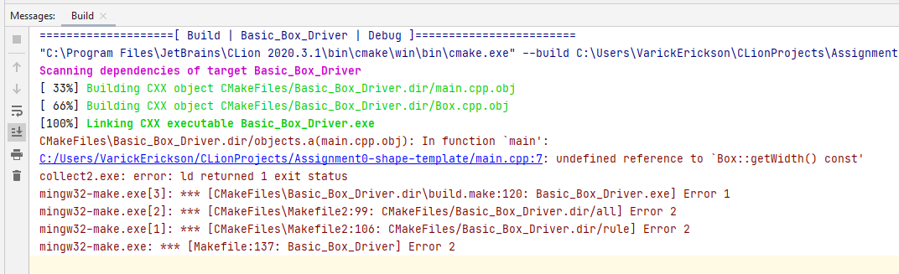

1.  Suppose the following code is used for the constructor of the box
    class:

    ```c++
    Box::Box() {
        double width = 0;
        double height = 0;
        double length = 0;
    }
    ```
    
    What is wrong with the following code snippet and why is it wrong? 
    
    > Your answer here.

2.  What would you need to do in order to fix the "undefined reference" error
    reported by the compiler?

    

    > Your answer here.

3.  What is the purpose of a default constructor?

    > Your answer here.

    What variables from the `Box` class should be set by the default 
    constructor?

    > Your answer here.

4.  In general, how do you determine the variables that should be 
    initialized by a default constructor?

    > Your answer here.