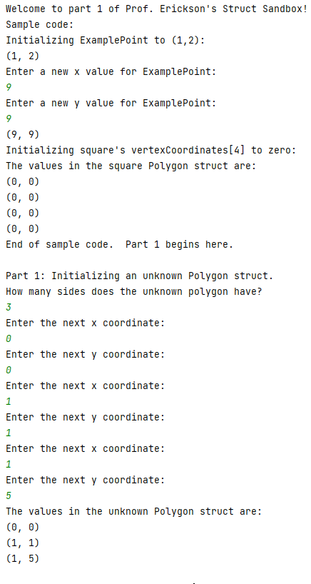
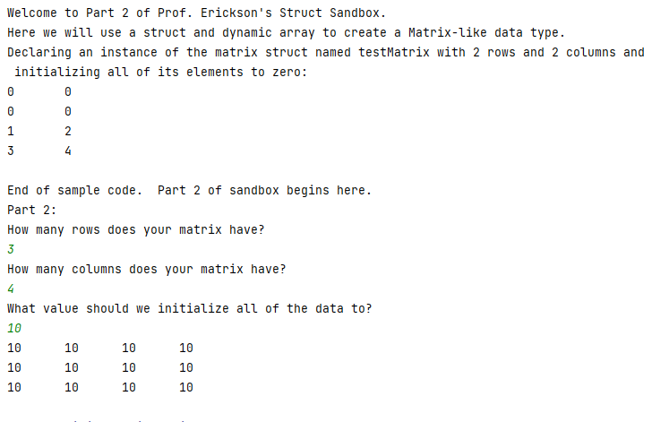
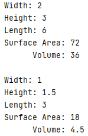

> **Late Days:** I am using 0 late days

# Assignment 9 3/4:  Struct and Dynamic Array Sandbox and Introduction to Classes

Original assignment written by Ashley Erickson.  
(C) 2022 Ashley Erickson

>**IMPORTANT!**
> Be sure to read and follow these instructions very carefully!
> These instructions contain hints and useful, required information needed
> to successfully complete the assignment!
> 
> This Assignment 9 3/4 is a combination of topics normally covered in Assignment 9 and Assignment 10.
> Due to pacing of lecture this semester, it makes more sense to combine these topics together.
> Therefore, this assignment is hereby named "Assignment 9 3/4".  
> This assignment will replace Assignment 9 and 10 in our syllabus.  
> Our next assignment after this one will be Assignment 11.


**Why this Assignment Matters:**

This assignment provides you practice with three very important topics: dynamic arrays, structs, and classes.
This assignment has a total of four parts.

In part 1 and part 2, you will practice using structs and dynamic arrays.
You will explore some applications where we don't know ahead of time how much data we will need
to manipulate.  By using dynamic arrays, we can declare arrays with exactly enough space
to hold our data.  We also use structs to efficiently organize data in the form of x and y 
coordinates, matrices, and PGM images. In parts 3 and 4 of this assignment, you will practice using classes.
In part 3, we look at a simple Box class and apply the topics
discussed in class to create Box member functions.  In part 4, you will answer a few questions 
to help remember key points about designing and implementing classes.  

Make sure you understand these topics well.  We will build upon these fundamentals and take a deeper
look at the capabilities of objects and classes in future assignments.

A crucial part of programming is learning to carefully follow instructions
and pay attention to detail!   You will also practice these skills
as **this assignment requires that you follow these instructions
exactly.**

For part 1 and part 2 of this assignment, you will first complete the struct and dynamic array sandboxes to 
get comfortable with structs and dynamic arrays.
Then, you will update the class in part 3.
Finally, in part 4, you will answer a few questions about classes 
in the Part2_Questions.md file.
There are 20 total points possible in this assignment.

13 points will be autograded, with the remaining 7 points given by Prof. Erickson
for answering the questions in part 4, writing clear preconditions and postconditions 
for the Box class functions
and for following the good coding practices listed in the rubric and discussed in class.

**Grading rubric (20 points possible)**

| Points | Requirements |
|----------|----------|
|2|Part 1 (part1.cpp) Part 1 Struct and Dynamic Array Sandbox output exactly matches sample (autograded).
|2|Part 2 (part2.cpp) Part 2 Struct and Dynamic Array Sandbox output exactly matches sample (autograded).
|3|Part 3 Constructor test definitions and output matches instructions (autograded).
|2|Part 3 Getter and Setter function definition and output matches instructions (autograded).
|2|Part 3 Volume and Area definition and output matches instructions (autograded).
|2|Part 3 Resize definition and output matches instructions (autograded).
|4|Part 4 Questions about Box class answered correctly as comments in Part4_Questions.md file (manually graded).
|3|Good coding practices followed for all parts, including: Part 3 Preconditions and postconditions written in Box.h for all Box class member functions describing required initial conditions and result after each function is called.  Good coding practices followed, including self-commenting variable names, one statement per line, no more than 80 characters per line, properly indenting inside braces/loops/if statements, and including descriptive comments explaining changes with each commit and push to GitHub (manually graded).


Note: You are allowed unlimited attempts ahead of the due date.
So, if you do not achieve full
points after your initial submissions, you may resubmit as many times as you want
until you have reached the deadline or achieved the point total you want.

**Late Day Use**

If you decide to use one or more of your three late days on this assignment, make sure that you
indicate how many late days you are using by updating the "I am using 0 Late Days" text in
the readme.

## Part 1: Prof. Erickson's Struct and Dynamic Array Sandbox 

Part 1 should be completed in the provided file part1.cpp.
The purpose of part1.cpp is to familiarize you with structs and dynamic arrays so that you
are ready to use these tools in part 2 and future assignments.

In part1.cpp, you are provided with starter code showing examples of a Point struct and 
Polygon struct.  Notice that the XYPoint struct is designed to hold an x and y coordinate.  
The Polygon struct contains a value to specify the number of sides that the polygon has
(for example, a square has 4 sides, triangle has 3 sides, etc.).  The Polygon struct
also contains a dynamic array of XYPoint structs, which holds the (x, y) coordinates
of each point.  So, a polygon with 4 sides would have 4 (x, y) points stored in the 
vertexCoordinates array.

```c++
//declare struct for XY point
//this struct holds an x coordinate and a y coordinate for a data point

struct XYPoint 
{
    double xCoord;
    double yCoord;
};

//Declare polygon struct
struct Polygon 
{
    int numSides;    //number of sides in the polygon
    XYPoint *vertexCoordinates;  //pointer to dynamic array of XYPoint values for each coordinate
};
```
You are also provided with a working function declaration and definition
for a void function called outputDataPoint.  This function accepts an argument
of XYPoint type and outputs the values to the screen as "(xCoord, yCoord)".  You may 
use this function in your code for part1.cpp.

```c++
void outputDataPoint(XYPoint Datapoint) 
{
    cout << "(" << Datapoint.xCoord << ", ";
    cout << Datapoint.yCoord << ")";
}
```

Your task for part1.cpp is to follow the instructions and sample code provided to
declare and initalize a Polygon struct named ``unknown`` based on the user's inputs. You will
be prompting the user for a numberOfSides and x and y coordinates for each vertex or corner of 
the unknown polygon.

The Polygon ``unknown`` is already initialized for you, and the user is prompted for the 
value ``numberOfSides`` which you should use in part1.cpp.  You will need to initialize
the numSides value of the unknown polygon to have the value ``numberOfSides`` provided by
the user.

Then, following the examples in part1.cpp, use a loop to prompt the user for the x 
and y coordinates for each vertex and store each (x, y) point in unknown's 
``vertexCoordinates`` array.  When finished entering values, output all the coordinates
to the screen.  You may use the provided function ``outputDataPoint`` to assist with outputting
the (x, y) coordinate in the desired format. Each (x, y) coordinate is outputted on a newline
as shown in the sample below.




Notice that the text "Enter the next x coordinate:" and
"Enter the next y coordinate" has no space after the : and ends with a newline
so that the user's input appears on the next line.

**Verifying your part1.cpp**
If your part1.cpp runs per the instructions and matches the desired output, 
you should receive 2 points.
Make sure you do not modify any other sections of part1.cpp besides the "unknown"
section specified in these instructions.


## Part 2: Prof. Erickson's Struct and Dynamic Array Sandbox (part 2)


Part 2 should be completed in the provided file part2.cpp.
The purpose of part2.cpp is to familiarize you with structs and 2D dynamic arrays.
You will want to be comfortable with dynamic arrays as they do come up in future assignments and programs, 
and sometimes Prof. Erickson likes to ask about them on quizzes and exams.

In part2.cpp, you are provided starter code for a Matrix_T struct.
This struct is designed to behave like a matrix from math or linear algebra class, 
with a number of rows,
a number of columns, and an array of values.

```c++
//declare struct named Matrix_T (_T is short for _Type)

struct Matrix_T {
    int numRows;  //stores number of rows in the matrix
    int numCols;   //number of columns in the matrix
    int** values;    //2D dynamic array to hold the values
};
```

We can use a similar approach with the dot operator, structs, and loops to manipulate this
Matrix struct.  However, notice that the Matrix struct includes the line ``int** values``.
This line declares a 2D dynamic array in the Matrix struct.  Using a dynamic array
lets us accept any number of values in the array without worrying about specifying a maximum size.
That way, we don't need to know ahead of time how many values the matrix will contain.


In the part2.cpp sample code, and example is provided
showing how this 2D dynamic array can be declared and initialized for a 
Matrix of numRows rows and 
numCols columns.

In part 2, your task is to use a similar approach as the sample code provided
to declare and initialize the provided `inputMatrix` so that inputMatrix's ``numRows`` 
is initialized to
the user-specified value ``numberOfRows``, and inputMatrix's `numCols` 
is initialized to the user-specified value `numberOfCols`, and all the values in the ``values`` 
dynamic array are 
initialized to the user-specified int
value `arrayValue`.


```c++
//Starter code for Part 2
int numberOfRows, numberOfCols, arrayValue;

Matrix_T inputMatrix;
cout << "How many rows does your matrix have?" << endl;
cin >> numberOfRows;
cout << "How many columns does your matrix have?" << endl;
cin >> numberOfCols;
cout << "What value should we initialize all of the data to?" << endl;
cin >> arrayValue;
```




In this sample, the unknown matrix is initialized to have
3 rows and 4 columns per the user's specifications.
All values are initialized to the user-provided value, 10.

Notice that each value is outputted with a single tab ("\t") in between.
There is a newline between rows of data.
Notice that the sample outputs from the part2 sandbox also appear.
Do not modify the sample code before the unknown array, otherwise your
program may not grade properly.


**Verifying your part2.cpp**
If your part1.cpp runs per the instructions, you should receive 2 points.
Make sure you do not modify any other sections of part2.cpp besides the
inputMatrix sections specified in these instructions.


## Part 3: The Box class

**Part 3 should be completed in the provided files Box.cpp and Box.h.**
(Be careful that you do not modify the main function in Part3.cpp otherwise this may
prevent your program from grading properly)
The purpose of part 3 is to familiarize you with 
declaring classes and implementing member functions of a class.


## About the Box class, Box.h, Box.cpp and Part3.cpp

For this first assignment on classes, we will look at a simple example.
We will continue to build on these topics in future assignments,
so make sure you understand how these classes work and how
to declare and implement the member variables and member functions.

In part3, you are provided with three files:

- Part3.cpp: This file contains a working main function which uses
the Box class.  **Do not modify Part3.cpp**
  
- Box.h:  The header file "Box.h" contains
the declaration of the Box class.  **Do not modify Box.h, 
  except for adding preconditions and postcondition comments next to each
  function declaration**

- Box.cpp:  The implementation file "Box.cpp" is where the 
function definitions should be written.  **Your task is to add the function
  definitions to Box.cpp so that the Box class runs properly.  Make
  sure you read the instructions below to understand what each function 
  needs to do.**


This Box class is designed to store
information and functions for a 3D rectangular box.  Notice that we
have private variables for length, width and height.  We also have
functions to access the private variables (setWidth, getWidth, etc) and
additional functions to perform calculations (getArea, Resize).

As discussed in class, the function definitions are to be stored in the "Box.cpp" 
implementation file.  Currently this implementation file is empty.  Your task
is to follow the procedures discussed in class to correctly complete the implementation file
and add all the member function definitions so that the main function and Box class
executes properly.  Follow the 
instructions below to learn more about each function.  A sample output for the main 
function is also shown at the end of these part 3 instructions.

Be sure to read the directions carefully.  There will be very specific 
messages that must be used in for the throws in order to receive full credit.

## Box Functions

The following are the functions you will be implementing along with how they
should behave.

### `Box()`

The default constructor should initialize the width, height, and length 
of a rectangle to 0.  Be careful to initialize the existing private variables.
You should not be redeclaring private variables in the default constructor.

### `Box(int initWidth, int iniHeight, int initLength)`

This constructor should set the width, height, and length of a Box object.  It
should throw the string "Negative dimension" if a negative value is used for 
width, height, or length.  

### `getWidth() const`

This should return the private variable width.

Notice the const modifier is used on this function.  It is a good practice to use
const on member functions which should not be modifying any
of the private variables.  Since the const modifier is included
in the declaration, you need to also remember to include const in your function
definition for this function as well.

### `getHeight() const`

This should return the private variable height.

Notice the const modifier is used on this function.  It is a good practice to use
const on member functions which should not be modifying any
of the private variables.  Since the const modifier is included
in the declaration, you need to also remember to include const in your function
definition for this function as well.


### `getLength() const`

This should return the private variable length.

Notice the const modifier is used on this function.  It is a good practice to use
const on member functions which should not be modifying any
of the private variables.  Since the const modifier is included
in the declaration, you need to also remember to include const in your function
definition for this function as well.


### `setWidth(double newWidth)`

This should set the width of the box to newWidth.  It should throw the string "Negative 
dimension" if a negative value is used.

### `setHeight(double newHeight)`

This should set the height of the box to newHeight.  It should throw the string "Negative 
dimension" if a negative value is used.

### `void setLength(double newLength)`

This should set the length of the box to newLength.  It should throw the string "Negative 
dimension" if a negative value is used.

### `double getSurfaceArea() const`

This should return the surface area of the box.
Note that surface area should be calculated using the 
private variable's length, width and height.

Notice the const modifier is used on this function.  It is a good practice to use
const on member functions which should not be modifying any
of the private variables.  Since the const modifier is included
in the declaration, you need to also remember to include const in your function
definition for this function as well.

### `double getVolume() const`

This should return the volume of the box.
Note that volume should be calculated using the
private variables length, width and height.

Notice the const modifier is used on this function.  It is a good practice to use 
const on member functions which should not be modifying any 
of the private variables.  Since the const modifier is included
in the declaration, you need to also remember to include const in your function
definition as well.

### `void resize(double factor)`

This function should resize the width, height, and length of the box using
`factor`.  For example, if the value of `factor` is 2.0 and `width` is 10, 
then `width` should be updated to 20.  If the value of `factor` is 0.5 and 
`height` is 10, then `height` should be updated to 5.  It should throw the 
string "Negative dimension" if a negative value is used.


## More on Throwing Errors (required in some of the Box member functions)

There are situations where the user may put bad data into functions. We will
handle these using a C++ function called "throw".  In future classes you
will learn more about throw.  For this class, we will use throws in a very
basic way.  For example, suppose the user inputs a negative value for the width:

```c++
box.setWidth(-100);
```

We want to tell the user that they didn’t use the function properly.  To do
this, we will utilize a "throw" in the `setWidth` function.

```c++
if (newWidth < 0) {
    throw "negative width";
}
```

One thing you might notice about throw() is that it is somewhat similar to the exit() 
function, except that any type of data can be thrown.  Also, the program does not
immediately terminate after a throw.  We can design other functions to catch 
these errors and respond with appropriate messages or counter measures to address the error.

In more advanced programming courses, you might learn about using the throw function
together with catch( ) function to proactively anticipate and react to potential errors in a program.
Throwing errors is an important tool used by programmers to help build programs which are
easier to test and debug.

**Verifying your Part 3 output**
If your box.cpp and runs per the instructions, you should receive a total of 13/13 points.
Make sure you do not modify any other sections of the Box class besides the preconditions
and postconditions in "Box.h" and adding function definitions to "Box.cpp".
If you have correctly declared and implemented your Box class, the main function should also 
run with no error messages.

If you received some but not all of the 13 points, go to GitHub, select actions, select your
latest commit, select autograding, and open the autograder to determine which functions
are not working properly based on the autograder's output.  You can also choose
to run the constructor, getter_setter, and other function tests individually using the dropdown menu
and check for specific error messages.

If your box class is implemented correctly, you should have the following 
output when running the Part 3 main function:



## Part 4: Review questions about classes

Part 4 of this assignment should be completed in the file Part4_Questions.md.
Your task for this part is to answer the questions in the Part4_Questions.md file.
These questions are based on common mistakes and common topics students misunderstand about classes.
Make sure you understand these questions well as they might reappear on a future exam.
The answers to several of these questions are discussed or demonstrated directly during lecture and
some hints are also given in these instructions.  Remember you are welcome to reach out via email,
Discord/Slack, or help hours if you have questions.

Note: to modify a .md file, you can open the file and directly edit the text.
You can also click on the file in GitHub, select the edit option, and add text from within GitHub.
These questions will be manually graded by Prof. Erickson.  Make sure your Part2_Questions.md
file is completed and pushed to GitHub so that you can receive credit for the questions.

**Verifying you are finished with this assignment**

If your Assignment 9 3/4 shows 13/13 in GitHub, then you have
successfully passed all the autograded tests and your code is correct.
**Be sure to review the rubric and make sure that you have completed all
parts of the assignment, including answering the part 4 questions, 
writing preconditions and postconditions, use of good coding practices and
including your push and commit comments for all parts.**

If you are having trouble, be sure to reach out for help from Prof. Erickson
in order to complete the remaining sections and receive credit
for this assignment.

Remember, you are allowed unlimited attempts before the deadline, so
you may edit and resubmit parts 1-4 as many times as you need
before the due date.

**Academic Integrity and Copyright Reminder**

Be reminded that programming assignments you submit must be your own
original work.  Copying code off the internet, copying code from others,
or allowing someone else to copy
your code is a violation of the Academic Integrity policy.  Violations will
result in a zero grade on the assignment for all involved.

You may discuss ideas and concepts with classmates but never
share your code with others.  That way, each student writes up
their own solutions independently and there is no risk of copying.
You are expected to take reasonable precautions to avoid sharing
or allowing others to copy your work without your knowledge.

If you or a classmate is having difficulty with this assignment,
you are welcomed and encouraged to ask for help via help hours,
our online Q&A (Slack/Discord)
or email Prof. Erickson.  Campus tutoring resources are also available.
Be reminded that your submission must be your own original work.
Having someone else "walk you through" the assignment or copying
someone else's work is prohibited per academic integrity rules.

Be aware that Prof. Erickson holds the copyright to this assignment.
Posting this assignment online without prior written authorization from
Prof. Erickson is prohibited and may be considered an academic integrity
violation.

Parts of this assignment were adapted from the CS301 Box class review assignment,
(C) 2021 Varick Erickson.

